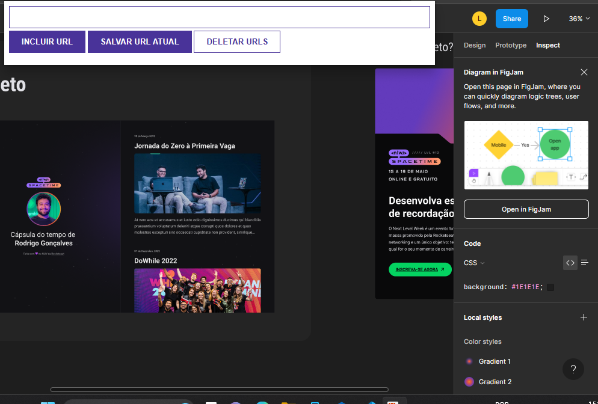
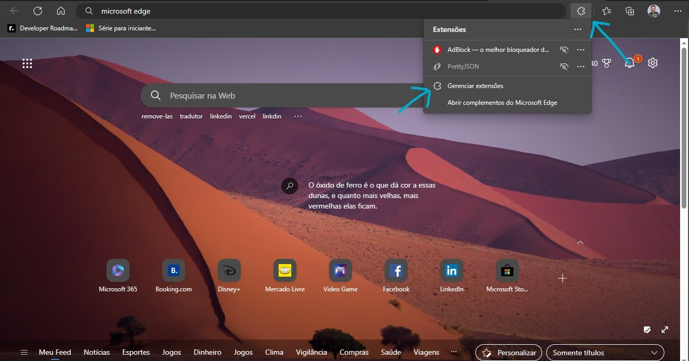
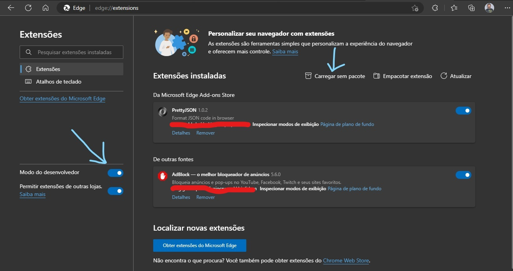

<h1 align="center">Extensão URLs</h1>

Extensão com finalidade de navegar pelo browser e salvar suas URLs favoritas, com poder de removê-las também quando quiser.
 

## Demo

  

## 🚀 Tecnologias

Esse projeto foi desenvolvido com as seguintes tecnologias:

- HTML5
- CSS3
- JavaScript

## 💻 Projeto
### Como rodas o projeto
- Primeiro faça o clone te deste projeto.
### Como funciona o projeto (Observação)
- Este projeto tem a finalidade de salvar URLs, porém elas são salvas no Local Storage, então todas as vezes que você aplica deletar URLs você está limpando o seu Local Storage.
### Inserindo no Microsoft Edge
- Abra o browser e vá em extensões
- Genrenciar extensões
- Ative o modo desenvolvedor
- Depois de ativado vá em 'Carregar sem pacote'
- Carregue o projeto, e logo em seguida confira se sua extensão foi carregada.
- E agora é só usar a vontade.

  

  

  

  
